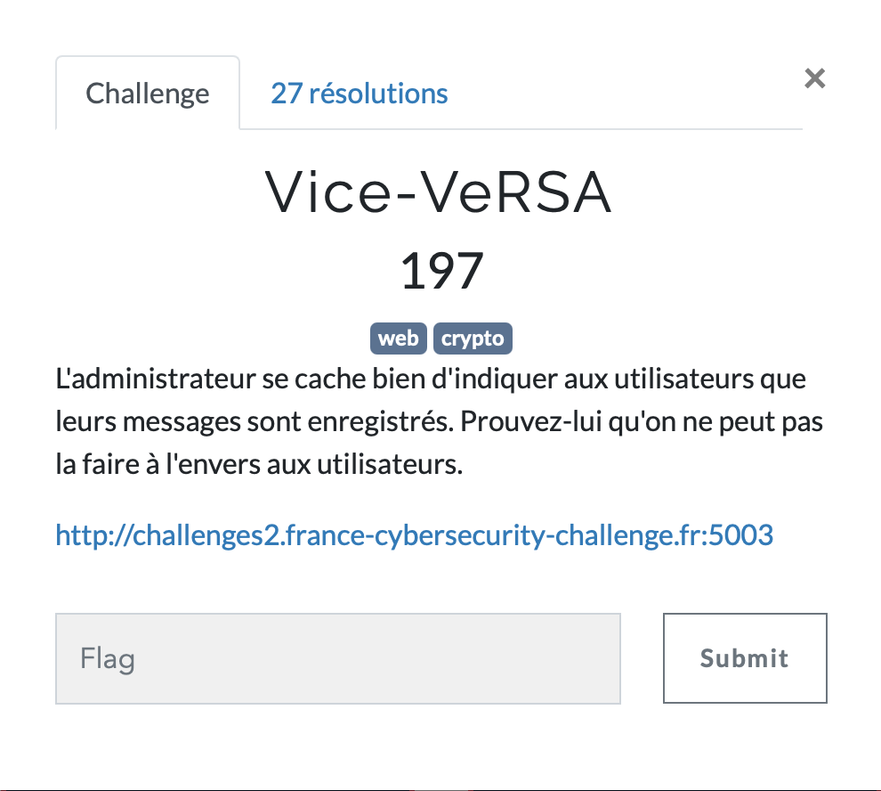
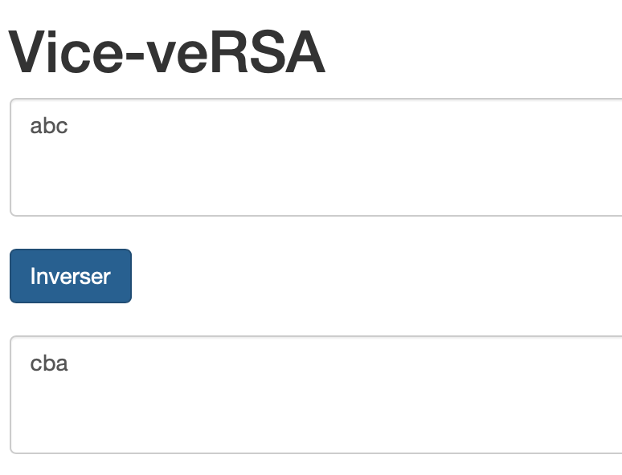
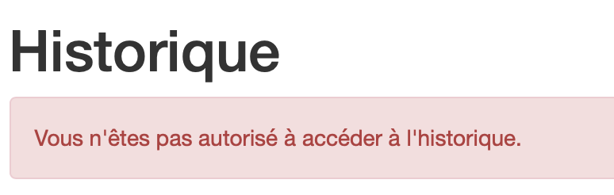
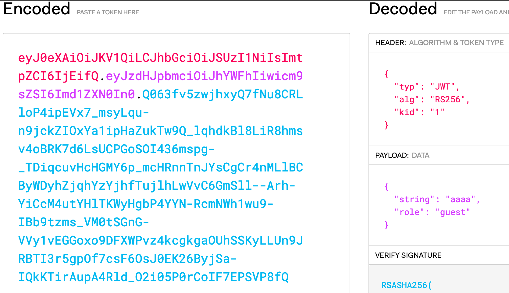

# ViceVeRSA

<p align="center">

</p>

On se connecte, on voit une page qui inverse une chaîne de caractère et une page de connexion.

<p align="center">

</p>

Dans les commentaires, nous voyons qu'il existe une page *historique*:
```html
<!-- <li><a href="/historique">Historique</a></li> -->
```

On peut en revanche voir que l'accès nous est interdit.

<p align="center">

</p>

On devine alors que notre objectif est d'accéder à cette page.

Si on regarde nos cookies, nous voyons un JSON Web Token (JWT)
reconnaissables au préfixe "eyJ".

On peut le decode en allant sur https://jwt.io/.

<p align="center">

</p>

On voit qu'il est signé avec RSA-256 et que dans le champs *payload*, nous avons
été attribué le rôle guest.

Il fallait avoir l'intuition de devoir faire passer ce rôle à admin.
On ne peut se contenter de changer le payload car la signature du token ne serait plus la bonne.

Le token est signé par RS256.
On voit le champ 'kid' à 1 laissant supposer qu'il y a plusieurs clés publiques.

Grâce à ce [tool](https://github.com/FlorianPicca/JWT-Key-Recovery), on peut récupérer la clé publique RSA avec deux tokens.

Je dump alors un autre token avec le 'kid' à 1 en changeant simplement le message dans la textbox.
Je fais tourner l'outil et récupère une clé RSA.

Je vais dans un onglet de navigation privée, en espérant obtenir un token avec un 'kid' différent de 1.
Une fois fait je redump 2 tokens différents et je recup encore la clé publique.

Nous avons les 2 N, il suffit de trouver le facteur commun.
Il suffit de faire en python
```python
import math
math.gcd(n0, n1)
```

Nous obtenons alors *p* et pouvons en déduire *q*.
Le tool précédent donne aussi l'exposant *e*.

On peut alors dump la clé privée avec [RSAtool](https://github.com/ius/rsatool).
```bash
python3 rsatool.py -n <n> -q <q> -p <p> -e <e> -f PEM -o privkey.pem
```

Nous pouvons désormais modifier le contenu d'un token (signé avec le même *kid* que la clé cassée), et le
signer à nouveau.

Cela peut être réalisé grâce à [jwt-tool](https://github.com/ticarpi/jwt_tool).
```bash
python3 jwt_tool.py <token> -pr privatekey.pem -pk publickey.pem -T -S rs256
```

Il n'y a plus qu'à se laisser guider et changer *guest* en *admin*.

On remplace notre cookie par celui obtenu, on accède à */historique* et on a le flag !

`FCSC{e1f444434b8c52a812e6dd0f59b71c32253018473384476feacc2fc9eefdc7be}`
